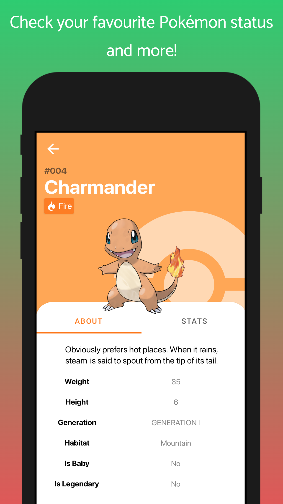

<h1 align="center">Rick And Morty</h1>

An Android APP using PokeApi's API :link: (https://pokeapi.co/). This project implements MVVM appying Single Source of Truth (SSOT) and some of the best practices in Android Development.

  
  
  

## Techs/Libraries
- [Kotlin](https://developer.android.com/kotlin)
- [Kotlin Flow](https://developer.android.com/kotlin/flow)
- [Kotlin Coroutines](https://github.com/Kotlin/kotlinx.coroutines)
- [Material Components](https://github.com/material-components/material-components-android)
- [Dagger Hilt](https://dagger.dev/hilt/)
- [Coil](https://github.com/coil-kt/coil)
- [Safe-Args](https://developer.android.com/guide/navigation/navigation-pass-data)
- [Android Jetpack](https://developer.android.com/jetpack)
  - [Navigation Component](https://developer.android.com/guide/navigation/navigation-getting-started)
  - [View Binding](https://developer.android.com/topic/libraries/view-binding)
  - [ViewModel](https://developer.android.com/topic/libraries/architecture/viewmodel)
  - [Lifecycle](https://developer.android.com/topic/libraries/architecture/lifecycle)
  - [Room](https://developer.android.com/training/data-storage/room)
- [Retrofit](https://square.github.io/retrofit/)
- [Gson](https://github.com/google/gson)
- [Timber](https://github.com/JakeWharton/timber)
